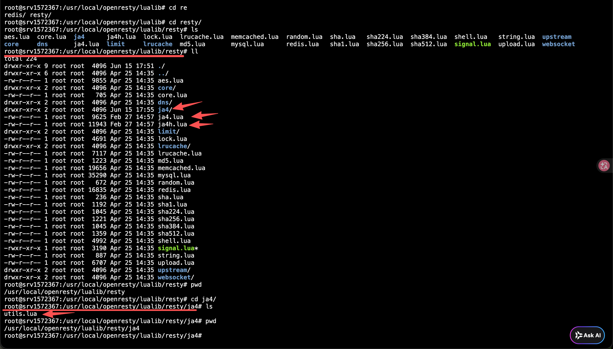

# 安装
## 简介
将 JA4（TLS 客户端指纹）和 JA4H（HTTP 客户端指纹）传输到后端


## 安装流程
- 将  lua-resty-ja4/lib/resty/ja4.lua 、lua-resty-ja4/lib/resty/ja4h.lua 拷贝到 /usr/local/openresty/lualib/resty 目录
- 将  lua-resty-ja4/lib/resty/ja4/utils.lua 拷贝到 /usr/local/openresty/lualib/resty/ja4




## Nginx 配置
以下配置是省略了很多配置项，此处仅简单示意

```conf

root@srv1572367:~/apps/Berries-NGINX/000.SOURCE_CODE/NGINX-1.24.0/build-output# cat nginx.conf
http {
        # 导入库 <=======
        lua_package_path "/usr/local/openresty/lualib/?.lua;;";

        include /root/apps/Berries-NGINX/000.SOURCE_CODE/NGINX-1.24.0/build-output/serviers/*.nginx.conf;
}

server {
        # 定义变量，用于存储 JA4 / JA4H 指纹
        set $ja4_fingerprint "";
        set $ja4h_fingerprint "";

        # 将 JA4 指纹带到后端（TLS 握手阶段）
        ssl_client_hello_by_lua_block {
            local ok, ja4 = pcall(require, "resty.ja4")
                if ok then
                  ngx.ctx.ja4_fingerprint = ja4.compute() or "unknown"
                else
                  ngx.log(ngx.WARN, "[JA4] failed: ", ja4)
                  ngx.ctx.ja4_fingerprint = "unknown"
                end
        }
        # 变量写操作移到这里
        rewrite_by_lua_block {
            ngx.var.ja4_fingerprint = ngx.ctx.ja4_fingerprint or "unknown"

            -- JA4H 需要在 rewrite 阶段计算（此时 HTTP 请求头已可用）
            local ok, ja4h = pcall(require, "resty.ja4h")
            if ok then
                ngx.var.ja4h_fingerprint = ja4h.compute() or "unknown"
            else
                ngx.log(ngx.WARN, "[JA4H] failed: ", ja4h)
                ngx.var.ja4h_fingerprint = "unknown"
            end
        }

        location ~ ^/(api|gateway)/ {
                # 将 JA4 / JA4H 指纹通过请求头透传给后端
                proxy_set_header X-JA4-Fingerprint $ja4_fingerprint;
                proxy_set_header X-JA4H-Fingerprint $ja4h_fingerprint;

                proxy_pass http://127.0.0.1:8088; # 核心：转发到 8003 端口
        }
}

```

## 示例
: 后端日志
```txt
2026-06-16 07:59:17  INFO CYBER_CLOAK::web_api::handlers::ja4_fingerprint_handler: [f4cdad3e-cb07-4066-927c-370316778b66] [Ja4FingerprintHandler] X-JA4-Fingerprint: Some("t13d1614h2_86a278354501_e452d144df5e"), X-JA4H-Fingerprint: Some("ge11cn000000_861a3562e0ba_000000000000_000000000000")
```