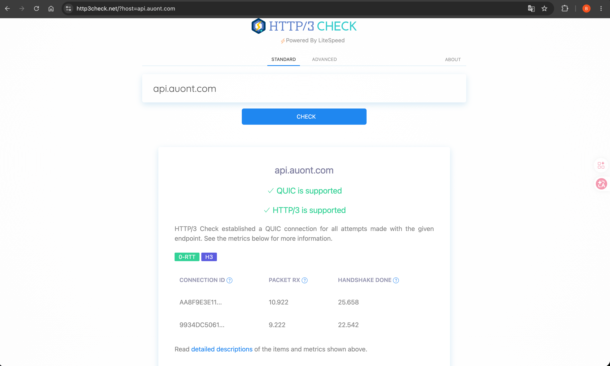
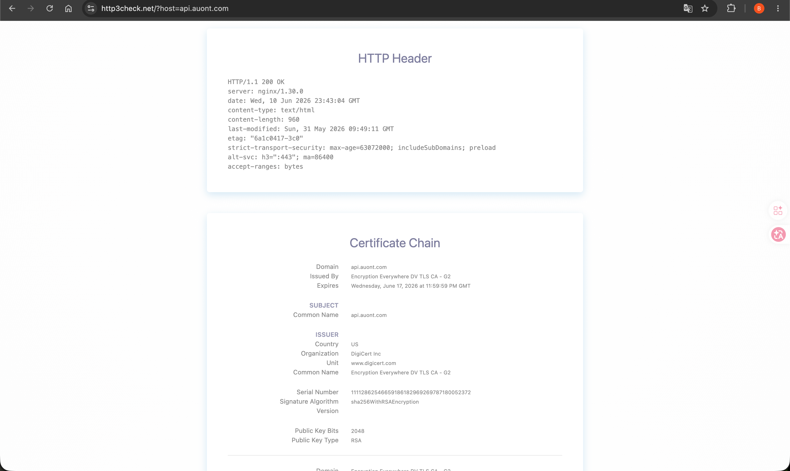
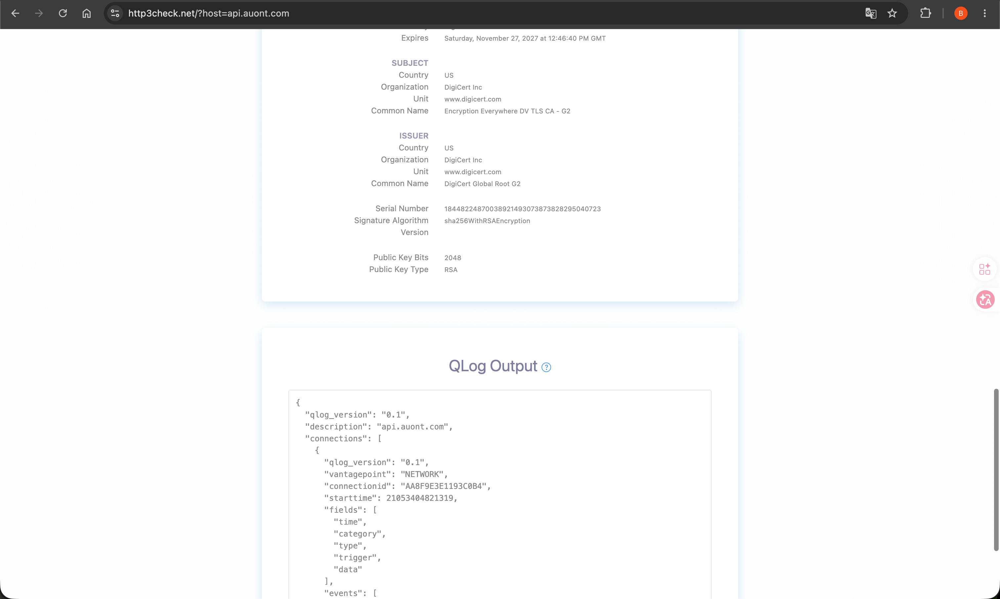

# 如何判断是否支持HTTP/3
- 
- 
- 
- QLog Output 
  ```txt
  {
  "qlog_version": "0.1",
  "description": "api.auont.com",
  "connections": [
    {
      "qlog_version": "0.1",
      "vantagepoint": "NETWORK",
      "connectionid": "AA8F9E3E1193C0B4",
      "starttime": 21053404821319,
      "fields": [
        "time",
        "category",
        "type",
        "trigger",
        "data"
      ],
      "events": [
        [
          0,
          "CONNECTIVITY",
          "NEW_CONNECTION",
          "LINE",
          {
            "ip_version": "4",
            "srcip": "0.0.0.0",
            "dstip": "76.13.29.190",
            "srcport": "39660",
            "dstport": "443"
          }
        ],
        [
          70,
          "CONNECTIVITY",
          "VERNEG",
          "LINE",
          {
            "proposed_version": "00000001"
          }
        ],
        [
          10922,
          "TRANSPORT",
          "PACKET_RX",
          "LINE",
          {
            "raw": "c00000000108aa8f9e3e1193c0b4140000000000001001d67c6a45ccd7f5c4...",
            "header": {
              "type": "INIT",
              "payload_length": "1184",
              "packet_number": "0"
            },
            "frames": [
              {
                "frame_type": "ACK"
              },
              {
                "frame_type": "PADDING"
              },
              {
                "frame_type": "CRYPTO"
              }
            ]
          }
        ],
        [
          10926,
          "CONNECTIVITY",
          "VERNEG",
          "PACKET_RX",
          {
            "agreed_version": "00000001"
          }
        ],
        [
          23411,
          "TRANSPORT",
          "PACKET_RX",
          "LINE",
          {
            "raw": "c70000000108aa8f9e3e1193c0b4140000000000001001d67c6a45ccd7f5c4...",
            "header": {
              "type": "INIT",
              "payload_length": "203",
              "packet_number": "1"
            },
            "frames": [
              {
                "frame_type": "ACK"
              },
              {
                "frame_type": "CRYPTO"
              }
            ]
          }
        ],
        [
          24523,
          "TRANSPORT",
          "PACKET_RX",
          "LINE",
          {
            "raw": "e70000000108aa8f9e3e1193c0b4140000000000001001d67c6a45ccd7f5c4...",
            "header": {
              "type": "HSK",
              "payload_length": "965",
              "packet_number": "0"
            },
            "frames": [
              {
                "frame_type": "CRYPTO"
              }
            ]
          }
        ],
        [
          24761,
          "TRANSPORT",
          "PACKET_RX",
          "LINE",
          {
            "raw": "ea0000000108aa8f9e3e1193c0b4140000000000001001d67c6a45ccd7f5c4...",
            "header": {
              "type": "HSK",
              "payload_length": "1184",
              "packet_number": "1"
            },
            "frames": [
              {
                "frame_type": "CRYPTO"
              }
            ]
          }
        ],
        [
          25023,
          "TRANSPORT",
          "PACKET_RX",
          "LINE",
          {
            "raw": "e10000000108aa8f9e3e1193c0b4140000000000001001d67c6a45ccd7f5c4...",
            "header": {
              "type": "HSK",
              "payload_length": "1184",
              "packet_number": "2"
            },
            "frames": [
              {
                "frame_type": "CRYPTO"
              }
            ]
          }
        ],
        [
          25373,
          "SECURITY",
          "CHECK_CERT",
          "CERTLOG",
          {
            "certificate": "30820607308204EFA0030201020210085C426CEE33250C36597DA8F0BAAF94300D06092A864886F70D01010B0500306E310B300906035504061302555331153013060355040A130C446967694365727420496E6331193017060355040B13107777772E64696769636572742E636F6D312D302B06035504031324456E6372797074696F6E204576657279776865726520445620544C53204341202D204732301E170D3236303332303030303030305A170D3236303631373233353935395A3018311630140603550403130D6170692E61756F6E742E636F6D30820122300D06092A864886F70D01010105000382010F003082010A0282010100ABD4B19CF27638EBEF1BDB2CA412E7F300A23747EAE7F0F63FAF79E84F8E8B2F4F04F6F1163837AE80794AE9549E412CAD0CD547D7C04482D8E24D0B33662F77F6CD9CE9BB34181AA203B0FF9A1CC1CC14C0AFC834CEA8F1369541586B58DC4682A55E9766FF787AF8FC1397DD888BEBBD9F602113466C9232E3AC60C775E9DEC9974FA57B318661D12655D499C462E89B67E9E31495140E6842B4BF1FB9B3EE28BAF7B0FD58DFE557B8C868D857E5506178F7A758003605825CC555520EEDF111E680932FA557D6C1D013D73BCE14E47956860F6AF9DA094901C05C03C745332DD41EDF0827E2957664C462DC9024F7A8361F53767706B464C96F4776AE121F0203010001A38202F5308202F1301F0603551D2304183016801478DF91905FEEDEACF6C575EBD54C5553EF244AB6301D0603551D0E041604145CD6CC258B6CC32001B2BA805B849FBC3FBD6538302B0603551D1104243022820D6170692E61756F6E742E636F6D82117777772E6170692E61756F6E742E636F6D303E0603551D20043730353033060667810C0102013029302706082B06010505070201161B687474703A2F2F7777772E64696769636572742E636F6D2F435053300E0603551D0F0101FF0404030205A0301D0603551D250416301406082B0601050507030106082B0601050507030230818006082B0601050507010104743072302406082B060105050730018618687474703A2F2F6F6373702E64696769636572742E636F6D304A06082B06010505073002863E687474703A2F2F636163657274732E64696769636572742E636F6D2F456E6372797074696F6E457665727977686572654456544C5343412D47322E637274300C0603551D130101FF0402300030820180060A2B06010401D679020402048201700482016C016A0077006411C46CA412ECA7891CA2022E00BCAB4F2807D41E3527ABEAFED503C97DCDF00000019D0A0EF3A00000040300483046022100C652DA65CAC06DA4B318B5BD8A820E36E9A32DFE3FD2BA98B306673A0921E2B5022100BE4C1196C78C89F7C62E213F04BD30E73E739178089E5553975C84E74BCD073F0077000E5794BCF3AEA93E331B2C9907B3F790DF9BC23D713225DD21A925AC61C54E210000019D0A0EF41B0000040300483046022100B38F47B22F53D067BBBACE19BDCAE336F454B7F66BEB47E5D4F28AC14E5F35D60221008E9B2A2859C61F01530438A8EE320E811746621B12A5944D79D63294015F19C5007600499C9B69DE1D7CECFC36DECD8764A6B85BAF0A878019D15552FBE9EB29DDF8C30000019D0A0EF3B20000040300473045022100EF991F8DAAF9BFFE7A9601D78A59459ED8BC8E9F88928ACFF5E741EFA9B436A5022067806948D07DD2D58B08290A26A11B68F0B07B1612637A45E913A8A13A5C9DE2300D06092A864886F70D01010B05000382010100EEFD43C5EEC1A4A855FC77F624094D51181A357F115404ACE8B18BC3051D9A9177BC465C75B407E48C86C1F3718E0899180BC4F2F8D27FD42BCC74142D783ACD2C98E9BEFF5A8C81797421A6D1F21FDBED4B9757B82C546B1609B24BA24F4D633F86F9D1A32FEEC2F3EC06FCC4BDA9DDD07E5A42ACF588C5F1C0A5E6D6651D2655805C83607A4192119821FB4B441CB44D4664A4D78F2B13A077D9123D42E1A777487455B7191E19B9B4341B95FA4BCB30BCE880B3821F8D38223A1602C4E92C4737214B2CCDAFDFDC0AF05D55B4A03A9FC0625418E84C8AF6808977E6871BFFAAB392A3390F0854A90423983E10172F3DFB72EB361D66212AF97BC26E31ABBF"
          }
        ],
        [
          25373,
          "SECURITY",
          "CHECK_CERT",
          "CERTLOG",
          {
            "certificate": "308204AA30820392A00302010202100DE0FFB5EE62CB61109F608C9CED5ED3300D06092A864886F70D01010B05003061310B300906035504061302555331153013060355040A130C446967694365727420496E6331193017060355040B13107777772E64696769636572742E636F6D3120301E06035504031317446967694365727420476C6F62616C20526F6F74204732301E170D3137313132373132343634305A170D3237313132373132343634305A306E310B300906035504061302555331153013060355040A130C446967694365727420496E6331193017060355040B13107777772E64696769636572742E636F6D312D302B06035504031324456E6372797074696F6E204576657279776865726520445620544C53204341202D20473230820122300D06092A864886F70D01010105000382010F003082010A0282010100EF147F8EA2FE7AFBA648130EA9C479221F085AAF3E752ADDA175B4C279861F4C9CEE8B9ADE547477C11B00BD4A2F978CAD76723660C4E6EC2FA460D678EF36100C27826E9CDD091864491927AF6C9B00DEC73AF276CF433B8AA7925CF2FA6BCA9DA6B6CDFCA52097A2B3D1FAC721422B0A03B39243532370537477BB5BADC79614D6F380BD9CB095507A880E04649EFCA644219C3A8172CA7857BB9AEA673582513A2DA20B5D7E1EE17BF6202DB4C737D82BFA50EC62C58FF7655F8BCE92E792516AF7C5CE460C242092F51EEBCF85AF32BDBF96E898AC95924BF872C5B62768C6623B426DD9C8857AE96E77DC3B06162985264CF7CB419E1D6B9254C6C895FB0203010001A382014F3082014B301D0603551D0E0416041478DF91905FEEDEACF6C575EBD54C5553EF244AB6301F0603551D230418301680144E2254201895E6E36EE60FFAFAB912ED06178F39300E0603551D0F0101FF040403020186301D0603551D250416301406082B0601050507030106082B0601050507030230120603551D130101FF040830060101FF020100303406082B0601050507010104283026302406082B060105050730018618687474703A2F2F6F6373702E64696769636572742E636F6D30420603551D1F043B30393037A035A0338631687474703A2F2F63726C332E64696769636572742E636F6D2F4469676943657274476C6F62616C526F6F7447322E63726C304C0603551D2004453043303706096086480186FD6C0102302A302806082B06010505070201161C68747470733A2F2F7777772E64696769636572742E636F6D2F4350533008060667810C010201300D06092A864886F70D01010B05000382010100A01B357822CA6A42ED5513C546304827D2C92F4B3C656BA6F14F3FD533159103019FE08F6F9C67083D06480E8BFD5D1916B30DA818ABAEBE41DB8D4E7AC102BF1222F7C6D9F7487DFAAFD7E5E332383DF97FC6136843297674029DAC08C221F1D3AFF405F8938FE6FF5D08A1FA6AADDD95DEC4D089A8A7B176207621619229C81A84F69C5A493F0404058AC28815812A1F357DEF84B7140CFFF0B21F0F9F319EC10D19FCF2203907DC9AF0619F1C68F4DFE995FD3351AB21237C1E7593B5D3421F6C446A345AFE1F590578D4C85290AC69369F685C2EB7D949BCA7102FE94B0FC44FB1F99D6C1C92398027597D7DC9DBAA453FA5FEAE3109A77E5D0942324D4A"
          }
        ],
        [
          25594,
          "TRANSPORT",
          "PACKET_RX",
          "LINE",
          {
            "raw": "e30000000108aa8f9e3e1193c0b4140000000000001001d67c6a45ccd7f5c4...",
            "header": {
              "type": "HSK",
              "payload_length": "54",
              "packet_number": "3"
            },
            "frames": [
              {
                "frame_type": "CRYPTO"
              }
            ]
          }
        ],
        [
          25658,
          "CONNECTIVITY",
          "HANDSHAKE",
          "PACKET_RX",
          {
            "status": "complete"
          }
        ],
        [
          57543,
          "TRANSPORT",
          "PACKET_RX",
          "LINE",
          {
            "raw": "49aa8f9e3e1193c0b4e3d856130a8e3aafa8213e76c2e5fd66ca063d3ad026...",
            "header": {
              "type": "SHORT",
              "payload_length": "1055",
              "packet_number": "0"
            },
            "frames": [
              {
                "frame_type": "STREAM"
              },
              {
                "frame_type": "ACK"
              },
              {
                "frame_type": "NEW_CONNECTION_ID"
              },
              {
                "frame_type": "CRYPTO"
              },
              {
                "frame_type": "HANDSHAKE_DONE"
              }
            ]
          }
        ]
      ]
    },
    {
      "qlog_version": "0.1",
      "vantagepoint": "NETWORK",
      "connectionid": "9934DC5061E49B26",
      "starttime": 21053404879679,
      "fields": [
        "time",
        "category",
        "type",
        "trigger",
        "data"
      ],
      "events": [
        [
          0,
          "CONNECTIVITY",
          "NEW_CONNECTION",
          "LINE",
          {
            "ip_version": "4",
            "srcip": "0.0.0.0",
            "dstip": "76.13.29.190",
            "srcport": "39660",
            "dstport": "443"
          }
        ],
        [
          37,
          "CONNECTIVITY",
          "VERNEG",
          "LINE",
          {
            "proposed_version": "00000001"
          }
        ],
        [
          9222,
          "TRANSPORT",
          "PACKET_RX",
          "LINE",
          {
            "raw": "c400000001089934dc5061e49b26140000000000001001db22f11b6e4ab552...",
            "header": {
              "type": "INIT",
              "payload_length": "1184",
              "packet_number": "0"
            },
            "frames": [
              {
                "frame_type": "ACK"
              },
              {
                "frame_type": "PADDING"
              },
              {
                "frame_type": "CRYPTO"
              }
            ]
          }
        ],
        [
          9224,
          "CONNECTIVITY",
          "VERNEG",
          "PACKET_RX",
          {
            "agreed_version": "00000001"
          }
        ],
        [
          21643,
          "TRANSPORT",
          "PACKET_RX",
          "LINE",
          {
            "raw": "c900000001089934dc5061e49b26140000000000001001db22f11b6e4ab552...",
            "header": {
              "type": "INIT",
              "payload_length": "209",
              "packet_number": "1"
            },
            "frames": [
              {
                "frame_type": "ACK"
              },
              {
                "frame_type": "CRYPTO"
              }
            ]
          }
        ],
        [
          22466,
          "TRANSPORT",
          "PACKET_RX",
          "LINE",
          {
            "raw": "e800000001089934dc5061e49b26140000000000001001db22f11b6e4ab552...",
            "header": {
              "type": "HSK",
              "payload_length": "959",
              "packet_number": "0"
            },
            "frames": [
              {
                "frame_type": "PADDING"
              },
              {
                "frame_type": "CRYPTO"
              }
            ]
          }
        ],
        [
          22542,
          "CONNECTIVITY",
          "HANDSHAKE",
          "PACKET_RX",
          {
            "status": "complete"
          }
        ],
        [
          22564,
          "RECOVERY",
          "RTT_UPDATE",
          "PACKET_RX",
          {
            "zero_rtt": "successful"
          }
        ],
        [
          50498,
          "TRANSPORT",
          "PACKET_RX",
          "LINE",
          {
            "raw": "c500000001089934dc5061e49b26140000000000001001db22f11b6e4ab552",
            "header": {
              "type": "INIT",
              "payload_length": "57",
              "packet_number": "4611686018427387904"
            }
          }
        ],
        [
          50612,
          "TRANSPORT",
          "PACKET_RX",
          "LINE",
          {
            "raw": "c200000001089934dc5061e49b26140000000000001001db22f11b6e4ab552",
            "header": {
              "type": "INIT",
              "payload_length": "57",
              "packet_number": "4611686018427387904"
            }
          }
        ],
        [
          50629,
          "TRANSPORT",
          "PACKET_RX",
          "LINE",
          {
            "raw": "eb00000001089934dc5061e49b26140000000000001001db22f11b6e4ab552",
            "header": {
              "type": "HSK",
              "payload_length": "40",
              "packet_number": "1"
            },
            "frames": [
              {
                "frame_type": "PADDING"
              },
              {
                "frame_type": "PING"
              }
            ]
          }
        ],
        [
          50650,
          "TRANSPORT",
          "PACKET_RX",
          "LINE",
          {
            "raw": "ef00000001089934dc5061e49b26140000000000001001db22f11b6e4ab552",
            "header": {
              "type": "HSK",
              "payload_length": "40",
              "packet_number": "2"
            },
            "frames": [
              {
                "frame_type": "PADDING"
              },
              {
                "frame_type": "PING"
              }
            ]
          }
        ],
        [
          51114,
          "TRANSPORT",
          "PACKET_RX",
          "LINE",
          {
            "raw": "5c9934dc5061e49b2664db9bb2b0f74e678c8f7e1d7955bd15cfe81bcea959...",
            "header": {
              "type": "SHORT",
              "payload_length": "785",
              "packet_number": "0"
            },
            "frames": [
              {
                "frame_type": "STREAM"
              },
              {
                "frame_type": "ACK"
              },
              {
                "frame_type": "NEW_CONNECTION_ID"
              },
              {
                "frame_type": "CRYPTO"
              },
              {
                "frame_type": "HANDSHAKE_DONE"
              }
            ]
          }
        ]
      ]
    }
  ]
  }
  ```